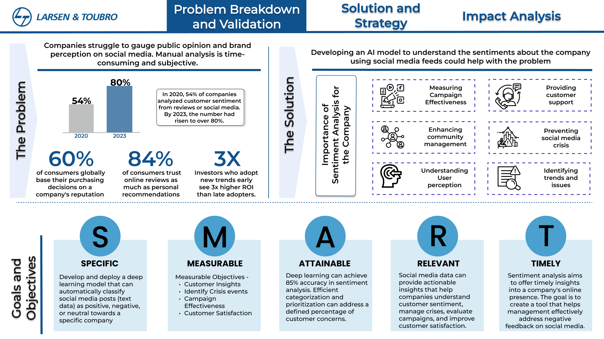
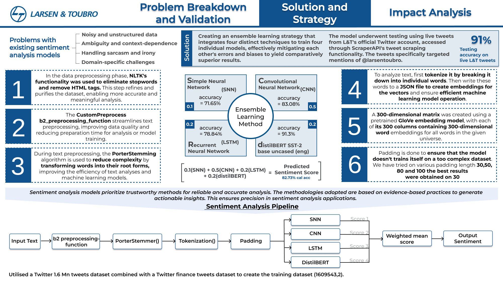
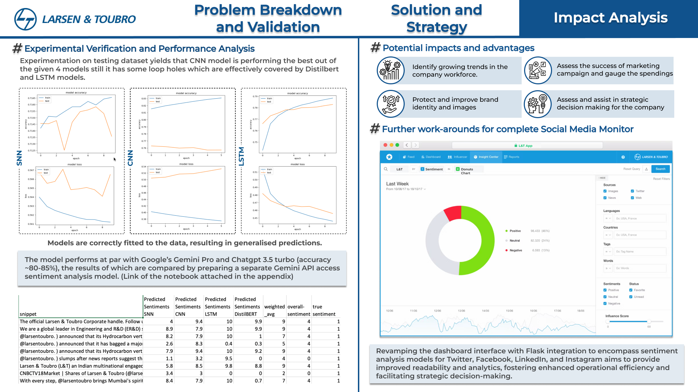

# sentiment-analysis

Plan of Action
1. Load Training.1600000.processed.noemoticon.csv Dataset (1.6 Mn twitter tweets) and a Twitter Finance Tweets Datasets
2. Pre-process dataset by removing special characters, numbers, etc. from user reviews + convert sentiment labels positive & negative to numbers 1 & 0, respectively
3. Import GloVe Word Embedding to build Embedding Dictionary + Use this to build Embedding Matrix for our Corpus
4. Model Training using Deep Learning in Keras for separate: Simple Neural Net, CNN, LSTM and DistilBERT Models and analyse model performance and results
5. Last, perform predictions on real L&T tweets

